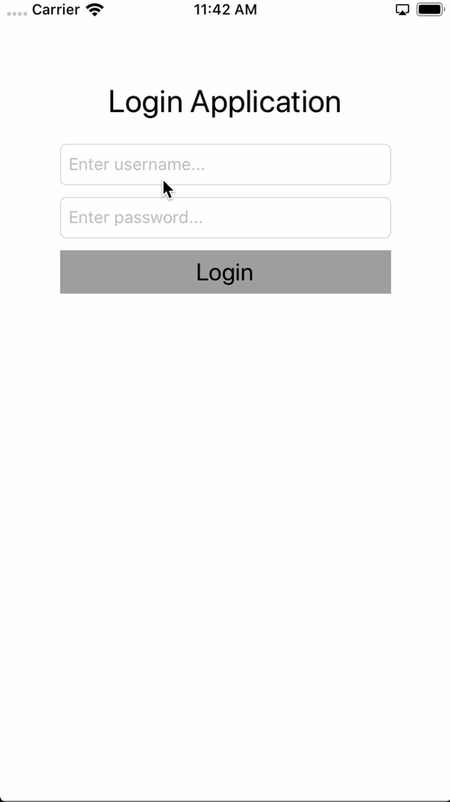

# Login Application

## About
This is a simple iOS application consisting of a single login page which leads to a tab bar. One of the tab is embedded with navigation controller to display working of navigation with tab bars.

## Installation and configuration
You can clone/download the repository and build the project. The project is built in <b>XCode 11.0 Beta</b><br>
1) Go to Utils.swift file and you will find enum AppURL, add your login url there.<br>
2) In LoginViewController.swift, at loginButtonCLicked method you will find a commented line, uncomment this line to have an API call:<br>
```swift
getUser(userName:userName,password:password)
```
3) Comment/remove the demo code:
```swift
 if userName == "abc" && password == "abc" {
            navigate()
        } else {
            showAlert(title: "Login Error", message: "Something went wrong!")
        }
```

## Documentation
1)<b> Design Pattern used: </b> MVVM<br>
2)<b> API call: </b> Yes, it is a generic API call<br>
3) I have added a few files such as Config.swift, Utils.swift, Keys.plist. These files helps the common information such as API key, Segue ids, etc grouped at one place.<br>

## GIF
<a href=""></a>
